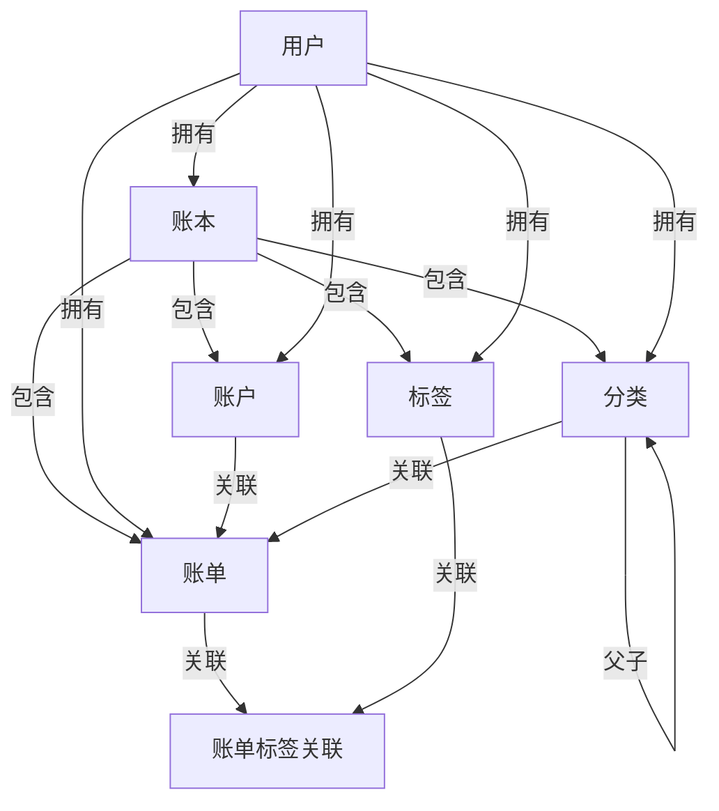
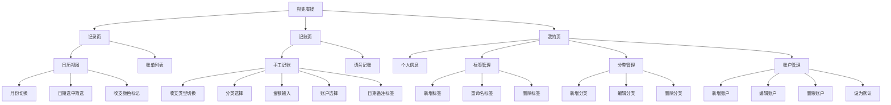

> 本文件只描述需求相关信息，逻辑说明，功能实现方式，不写具体的技术实现和UI要求

# 一、版本信息

| **文档版本** | **变更人** | **时间** | **主要变更内容** |
| ------------ | ---------- | -------- | ---------------- |
| v0.1.0       | 谢天       |          | 创建文档         |

# 二、需求概述

## 需求背景 

用户有日常记账需求，需要开发一个微信记账小程序

## 需求目标

支持日常手工记账；支持语音记账

## 用户画像

## 方案说明

一期开发微信小程序，接入语音大模型；二期开发APP

## 用户故事

| **#** | **用户故事**                                                             | **验收标准**                                                                                                                               | **优先级** | **版本** |
| ----- | ------------------------------------------------------------------------ | :----------------------------------------------------------------------------------------------------------------------------------------- | ---------- | -------- |
| US-01 | 作为用户，我希望手动添加一笔收入/支出记录，以便追踪日常资金流向          | 可选择收支类型、金额、分类、时间、备注；保存后立即显示在账单列表                                                                           | P0         | v1.0     |
| US-02 | 作为用户，我希望通过语音描述来记账，以便在不方便打字时快速录入           | 识别语音后自动解析金额、分类、备注并填入表单；用户可修改后确认保存                                                                         | P0         | v1.0     |
| US-03 | 作为用户，我希望查看按日/月汇总的账单，以便了解整体收支情况              | 可按日、月维度切换；显示总收入、总支出、结余                                                                                               | P1         | v1.0     |
| US-04 | 作为用户，我希望按分类查看支出占比，以便发现消费习惯                     | 显示各分类金额及百分比；支持按月/年/全部 + 一级/二级 + 支出/收入 三维切换；摘要卡展示同比/环比，含关键洞察、TOP 单笔、日均折线、月度热力图 | P1         | v1.0     |
| US-05 | 作为用户，我希望编辑或删除已有账单记录，以便纠正录入错误                 | 可修改全部字段；记录页账单支持左滑编辑和删除；删除后 Toast 反馈，软删除不影响历史统计                                                      | P0         | v1.0     |
| US-06 | 作为用户，我希望自定义收支分类，以便记账更贴合个人习惯                   | 可新增、编辑、删除自定义分类；分类名称不可重复                                                                                             | P1         | v1.0     |
| US-07 | 作为用户，我希望设置多个账户（现金、银行卡、支付宝等），以便分账管理资产 | 可创建账户并在记账时选择；支持查看各账户余额                                                                                               | P0         | v1.0     |
| US-08 | 作为用户，我希望通过微信登录，以便无需注册即可使用                       | 微信授权后自动创建账号；个人数据与微信账号绑定                                                                                             | P0         | v1.0     |

## 系统规划

| **阶段** | **目标**                                       | **预计上线日期** | 实际上线日期 | 状态   |
| -------- | ---------------------------------------------- | :--------------- | :----------- | :----- |
| 第1阶段  | 微信小程序上线：手工记账 + 语音记账 + 账单统计 | -                | -            | 规划中 |
| 第2阶段  | APP 上线（iOS + Android）                      | -                | -            | 规划中 |

# 三、整体说明

## 实体关系



## 需求补充：意见反馈

### 页面说明

| #   | 对象     | 说明                                           |
| --- | -------- | ---------------------------------------------- |
| 1   | 页面作用 | 用户在“我的页”提交产品问题、建议或使用体验反馈 |
| 2   | 入口     | 我的页“意见反馈”入口进入二级页面               |
| 3   | 反馈内容 | 反馈意见必填，最多 1000 字                     |
| 4   | 反馈照片 | 照片选填，最多 3 张，支持选择、预览和删除      |
| 5   | 提交结果 | 提交成功后 Toast 提示并返回上一页              |

### 业务规则

| #   | 规则     | 说明                                                                         |
| --- | -------- | ---------------------------------------------------------------------------- |
| 1   | 必填校验 | 反馈意见去除首尾空格后为空时不可提交                                         |
| 2   | 图片数量 | 前后端均限制最多 3 张反馈照片                                                |
| 3   | 图片上传 | 先上传图片得到 URL，再提交反馈内容和图片 URL 列表                            |
| 4   | 存储方式 | 反馈记录写入 `feedbacks` 数据库表，照片保存为服务端文件并在表中保存 URL 列表 |

### 反馈表（feedbacks）

| 字段名     | 数据类型      | 必填 | 说明                                 |
| :--------- | :------------ | :--- | :----------------------------------- |
| id         | bigint        | 是   | 主键，自增                           |
| user_id    | bigint        | 是   | 关联用户                             |
| content    | varchar(1000) | 是   | 反馈意见                             |
| image_urls | json          | 否   | 反馈照片 URL 列表，最多 3 张         |
| status     | tinyint       | 是   | 处理状态：0 待处理，1 已处理，默认 0 |
| created_at | datetime      | 是   | 创建时间                             |
| updated_at | datetime      | 是   | 更新时间                             |

## 需求补充：数据导入入口

### 页面说明

| #   | 对象     | 说明                                                        |
| --- | -------- | ----------------------------------------------------------- |
| 1   | 页面作用 | 用户从“我的页”获取网页导入地址，在浏览器上传 Excel 账单数据 |
| 2   | 入口     | 我的页“数据工具”分组中的“数据导入”入口                      |
| 3   | 弹窗内容 | 展示可在网页浏览器打开的导入地址                            |
| 4   | 复制能力 | 支持一键复制导入地址                                        |

### 业务规则

| #   | 规则     | 说明                                                            |
| --- | -------- | --------------------------------------------------------------- |
| 1   | 地址生成 | 小程序根据当前环境 `BASE_URL` 拼接 `/import/bills` 作为导入地址 |
| 2   | 关闭弹窗 | 点击取消、关闭按钮或遮罩可关闭弹窗                              |
| 3   | 后续扩展 | Excel 上传页和账单解析入库流程后续基于该地址实现                |

## 数据结构

### 用户表 (users)

| 字段名     | 数据类型     | 必填 | 说明                     |
| :--------- | :----------- | :--- | :----------------------- |
| id         | bigint       | 是   | 主键，自增               |
| openid     | varchar(64)  | 是   | 微信 openid，唯一        |
| nickname   | varchar(50)  | 否   | 昵称                     |
| avatar_url | varchar(255) | 否   | 头像 URL                 |
| phone      | varchar(11)  | 否   | 手机号，固定11位数字     |
| status     | tinyint(1)   | 是   | 状态：1正常 0禁用，默认1 |
| is_deleted | tinyint(1)   | 是   | 软删除：0否 1是，默认0   |
| created_at | datetime     | 是   | 创建时间                 |
| updated_at | datetime     | 是   | 更新时间                 |

### 账本表 (ledgers)

| 字段名     | 数据类型    | 必填 | 说明                                        |
| :--------- | :---------- | :--- | :------------------------------------------ |
| id         | bigint      | 是   | 主键，自增                                  |
| user_id    | bigint      | 是   | 关联用户                                    |
| name       | varchar(50) | 是   | 账本名称，默认账本为“日常账本”              |
| scene_type | varchar(20) | 是   | 账本场景：personal 个人，company 公司       |
| is_default | tinyint(1)  | 是   | 是否默认账本：0否 1是，同用户下默认只有一个 |
| is_deleted | tinyint(1)  | 是   | 软删除：0否 1是，默认0                      |
| created_at | datetime    | 是   | 创建时间                                    |
| updated_at | datetime    | 是   | 更新时间                                    |

> 当前前端暂不展示和维护账本。新用户自动创建一个默认“日常账本”，存量数据迁移时统一关联到默认账本。除意见反馈表外，账户、分类、标签、账单等业务数据均按默认账本隔离。

### 账户表 (accounts)

| 字段名     | 数据类型      | 必填 | 说明                                       |
| :--------- | :------------ | :--- | :----------------------------------------- |
| id         | bigint        | 是   | 主键，自增                                 |
| user_id    | bigint        | 是   | 关联用户                                   |
| ledger_id  | bigint        | 是   | 关联账本                                   |
| name       | varchar(50)   | 是   | 账户名称，同用户下唯一                     |
| type       | tinyint       | 是   | 类型：1现金 2银行卡 3支付宝 4微信 5其他    |
| balance    | decimal(12,2) | 是   | 当前余额，默认0                            |
| icon       | varchar(50)   | 否   | 图标标识                                   |
| sort       | int           | 是   | 排序，默认0                                |
| is_default | tinyint(1)    | 是   | 是否默认账户：0否 1是，默认0；同用户下唯一 |
| is_deleted | tinyint(1)    | 是   | 软删除：0否 1是，默认0                     |
| created_at | datetime      | 是   | 创建时间                                   |
| updated_at | datetime      | 是   | 更新时间                                   |

### 分类表 (categories)

| 字段名       | 数据类型    | 必填 | 说明                                                            |
| :----------- | :---------- | :--- | :-------------------------------------------------------------- |
| id           | bigint      | 是   | 主键，自增                                                      |
| user_id      | bigint      | 是   | 关联用户                                                        |
| ledger_id    | bigint      | 是   | 关联账本                                                        |
| parent_id    | bigint      | 否   | 父分类 ID；NULL 为顶级分类，最多两级                            |
| name         | varchar(50) | 是   | 分类名称，同用户下同父级唯一                                    |
| type         | tinyint(1)  | 是   | 类型：1支出 2收入                                               |
| icon         | varchar(50) | 否   | 图标标识                                                        |
| sort         | int         | 是   | 排序，默认0                                                     |
| last_used_at | datetime    | 否   | 最近使用时间；记账保存时更新；NULL 表示从未使用；仅叶子分类有效 |
| is_deleted   | tinyint(1)  | 是   | 软删除：0否 1是，默认0                                          |
| created_at   | datetime    | 是   | 创建时间                                                        |
| updated_at   | datetime    | 是   | 更新时间                                                        |

> 系统内置分类以种子数据形式维护，新用户注册时自动复制一份到其名下；用户可自由编辑、删除。账单只可挂叶子节点分类（无子分类的节点）。

### 分类图标表 (category_icons)

| 字段名     | 数据类型    | 必填 | 说明                           |
| :--------- | :---------- | :--- | :----------------------------- |
| id         | bigint      | 是   | 主键，自增                     |
| icon       | varchar(20) | 是   | 图标内容，当前存 Unicode Emoji |
| name       | varchar(50) | 是   | 图标名称，如餐饮、交通、购物   |
| sort       | int         | 是   | 排序，默认0                    |
| is_enabled | tinyint(1)  | 是   | 是否启用：1启用 0禁用，默认1   |
| created_at | datetime    | 是   | 创建时间                       |
| updated_at | datetime    | 是   | 更新时间                       |

> 分类图标表仅维护可复用的分类图标库；新增或编辑分类时从该表选择图标。多个分类可以复用同一个图标；账户、导航、操作按钮等固定图标不进入该表。

### 账单表 (bills)

| 字段名      | 数据类型      | 必填 | 说明                         |
| :---------- | :------------ | :--- | :--------------------------- |
| id          | bigint        | 是   | 主键，自增                   |
| user_id     | bigint        | 是   | 关联用户                     |
| ledger_id   | bigint        | 是   | 关联账本                     |
| account_id  | bigint        | 是   | 关联账户                     |
| category_id | bigint        | 是   | 关联分类（叶子节点）         |
| type        | tinyint(1)    | 是   | 类型：1支出 2收入            |
| amount      | decimal(12,2) | 是   | 金额，必须 > 0               |
| remark      | varchar(255)  | 否   | 备注                         |
| bill_date   | date          | 是   | 记账日期                     |
| source      | tinyint(1)    | 是   | 来源：1手工录入 2语音识别    |
| voice_text  | varchar(500)  | 否   | 语音原始文本，语音记账时保存 |
| is_deleted  | tinyint(1)    | 是   | 软删除：0否 1是，默认0       |
| created_at  | datetime      | 是   | 创建时间                     |
| updated_at  | datetime      | 是   | 更新时间                     |

### 标签表 (tags)

| 字段名      | 数据类型     | 必填 | 说明                                                                       |
| :---------- | :----------- | :--- | :------------------------------------------------------------------------- |
| id          | bigint       | 是   | 主键，自增                                                                 |
| user_id     | bigint       | 是   | 关联用户                                                                   |
| ledger_id   | bigint       | 是   | 关联账本                                                                   |
| name        | varchar(20)  | 是   | 标签名，同用户下唯一                                                       |
| description | varchar(255) | 否   | 标签描述，用于解释标签含义和后续 AI 判断                                   |
| tag_type    | varchar(20)  | 是   | 标签分类：`economic`经济属性、`user`用户自建、`system`系统标签，默认`user` |
| can_edit    | tinyint(1)   | 是   | 是否允许编辑：0否 1是，默认1                                               |
| can_delete  | tinyint(1)   | 是   | 是否允许删除：0否 1是，默认1                                               |
| is_deleted  | tinyint(1)   | 是   | 软删除：0否 1是，默认0                                                     |
| created_at  | datetime     | 是   | 创建时间                                                                   |
| updated_at  | datetime     | 是   | 更新时间                                                                   |

### 账单标签关联表 (bill_tags)

| 字段名     | 数据类型 | 必填 | 说明       |
| :--------- | :------- | :--- | :--------- |
| id         | bigint   | 是   | 主键，自增 |
| bill_id    | bigint   | 是   | 关联账单   |
| tag_id     | bigint   | 是   | 关联标签   |
| created_at | datetime | 是   | 创建时间   |

> 删除标签时，bill_tags 对应记录同步删除；账单仅关联当前用户自己的标签。

### 分类标签关联表 (category_tags)

| 字段名      | 数据类型 | 必填 | 说明       |
| :---------- | :------- | :--- | :--------- |
| id          | bigint   | 是   | 主键，自增 |
| category_id | bigint   | 是   | 关联分类   |
| tag_id      | bigint   | 是   | 关联标签   |
| created_at  | datetime | 是   | 创建时间   |

> 当前用于给支出二级分类绑定经济属性标签；一个分类可绑定多个标签，本阶段自动绑定一个经济属性标签。

### 预置经济属性标签

经济属性标签使用 `tag_type=economic`，`can_edit=0`，`can_delete=0`，由系统预置并对每个用户初始化。

| 标签名     | 描述                                                                                                                                                                 |
| ---------- | -------------------------------------------------------------------------------------------------------------------------------------------------------------------- |
| 餐饮必要   | 日常基本饮食支出，包括三餐、买菜、米面粮油、基础食品、工作日便餐、家庭日常食材。不包括聚餐请客、高端餐厅、奶茶咖啡、零食饮料、夜宵、非必要外卖。                     |
| 居住刚性   | 维持基本居住条件所需的固定或必要支出，包括房租、物业、水电燃气、取暖费、宽带、基础维修。不包括装修升级、装饰摆件、家电换新、改善型家居消费。                         |
| 债务还款   | 偿还既有债务或信用负债的支出，包括房贷、车贷、信用卡还款、消费贷、借款还款、分期还款。不包括新的投资、储蓄、普通消费或账户间转账。                                   |
| 生活必要   | 维持基本生活、健康、工作和家庭责任的必要支出，包括通勤、基础通讯、医疗、教育、保险、赡养、基础日用品。不包括娱乐、旅游、兴趣消费、改善型购物。                       |
| 可选消费   | 非生存必需、可延后或可减少的消费，包括娱乐、购物、旅游、奶茶咖啡、游戏、数码、服饰、美妆、聚餐、非必要外卖。不包括基本餐饮、刚性居住、债务还款、医疗教育等必要支出。 |
| 转账投资   | 资金在账户、资产或投资产品之间转移，不代表真实消费的支出，包括基金、股票、理财、储蓄转入、账户间转账、证券入金。不包括餐饮、购物、居住、债务还款等实际消费。         |
| 不计入统计 | 不应纳入消费结构判断，或无法可靠判断经济属性的记录，包括报销冲账、退款、内部调整、误记、无法判断、临时占位。不作为优先选择，只有无法归类时使用。                     |

## 功能结构



## 功能清单

| **一级模块** | **二级模块** | **功能**         | **功能描述**                                                                                           | **优先级** | **状态** | 用户故事ID |
| ------------ | ------------ | ---------------- | ------------------------------------------------------------------------------------------------------ | ---------- | :------- | ---------- |
| 账单管理     | 手工记账     | 新增账单         | 选择收支类型、金额、分类、账户、日期、备注、标签后保存                                                 | P0         | 待开发   | US-01      |
| 账单管理     | 手工记账     | 快速添加二级分类 | 在分类选择网格末位单元格点击"添加"，弹出添加二级分类弹窗，完成后新分类自动插入并选中                   | P1         | 待开发   | US-06      |
| 账单管理     | 语音记账     | 语音识别记账     | 录音后调用大模型解析金额、分类、备注，填入表单供用户确认保存                                           | P0         | 待开发   | US-02      |
| 账单管理     | 账单列表     | 日历视图         | 日历展示每日收支，颜色区分收入/支出，支持月份切换，点击日期筛选账单                                    | P0         | 待开发   | US-03      |
| 账单管理     | 账单列表     | 账单列表         | 按 bill_date 倒序展示，按日分组；选中日期时只显示当日账单                                              | P0         | 待开发   | US-03      |
| 账单管理     | 账单详情     | 查看详情         | 点击账单条目查看完整信息                                                                               | P0         | 待开发   | US-01      |
| 账单管理     | 账单编辑     | 编辑账单         | 修改已有账单的所有字段                                                                                 | P0         | 待开发   | US-05      |
| 账单管理     | 账单编辑     | 删除账单         | 记录页左滑删除账单，删除成功后 Toast 反馈                                                              | P0         | 已开发   | US-05      |
| 统计分析     | 分类统计     | 分类占比 + 排行  | 月/年/全部 + 一级/二级 + 支出/收入 三维切换；环形图 + 排行榜 + 摘要同比/环比 + 关键洞察                | P1         | 已开发   | US-04      |
| 统计分析     | 经济指标     | 5项收入去向指标  | 展示恩格尔系数、生活刚性、债务还款、可选消费、储蓄率；月/年/全部切换时同步刷新；点击指标查看公式和说明 | P1         | 已开发   | US-04      |
| 统计分析     | 趋势分析     | 近 6 月 mini 柱  | 排行榜每行右侧显示近 6 个月迷你柱状图                                                                  | P1         | 已开发   | US-04      |
| 统计分析     | 异常发现     | TOP N 单笔       | 当期金额最大的 5 笔账单单独列出                                                                        | P1         | 已开发   | US-04      |
| 统计分析     | 时间分布     | 日均消费折线     | 月/年模式下按天聚合显示折线图                                                                          | P1         | 已开发   | US-04      |
| 统计分析     | 时间分布     | 月度热力图       | 月模式下当月每天支出按色阶深浅展示                                                                     | P1         | 已开发   | US-04      |
| 统计分析     | 下钻         | 分类账单弹层     | 二级分类点击展开该分类当期账单明细                                                                     | P1         | 已开发   | US-04      |
| 账户管理     | 账户列表     | 查看账户         | 展示所有账户及各账户余额                                                                               | P1         | 待开发   | US-07      |
| 账户管理     | 账户管理     | 新增账户         | 创建新账户，选择类型和名称，同用户下名称唯一                                                           | P1         | 待开发   | US-07      |
| 账户管理     | 账户管理     | 编辑账户         | 修改账户名称、类型                                                                                     | P1         | 待开发   | US-07      |
| 账户管理     | 账户管理     | 删除账户         | 软删除，有关联账单时不可删除                                                                           | P1         | 待开发   | US-07      |
| 账户管理     | 账户管理     | 设为默认         | 将指定账户设为默认账户，原默认账户自动取消                                                             | P1         | 待开发   | US-07      |
| 分类管理     | 分类列表     | 查看分类         | 按收/支两个 tab 展示两级分类树                                                                         | P1         | 待开发   | US-06      |
| 分类管理     | 分类管理     | 新增分类         | 新增大类或子分类，同用户同层级名称不可重复                                                             | P1         | 待开发   | US-06      |
| 分类管理     | 分类管理     | 编辑分类         | 修改分类名称和图标                                                                                     | P1         | 待开发   | US-06      |
| 分类管理     | 分类管理     | 删除分类         | 软删除；有子分类或关联账单时不可删除                                                                   | P1         | 待开发   | US-06      |
| 个人中心     | 登录         | 微信登录         | 微信授权登录，自动创建账号并初始化种子数据                                                             | P0         | 待开发   | US-08      |
| 个人中心     | 个人信息     | 查看资料         | 展示昵称、头像，不支持编辑                                                                             | P2         | 待开发   | US-08      |
| 个人中心     | 标签管理     | 查看标签         | 展示当前用户所有标签，并区分经济属性、用户自建、系统标签                                               | P2         | 待开发   | -          |
| 个人中心     | 标签管理     | 新增标签         | 创建用户自建标签，同用户下名称不可重复                                                                 | P2         | 待开发   | -          |
| 个人中心     | 标签管理     | 重命名标签       | 仅允许重命名可编辑标签，关联账单自动同步                                                               | P2         | 待开发   | -          |
| 个人中心     | 标签管理     | 删除标签         | 仅允许删除可删除标签，软删除标签并同步处理 bill_tags 关联                                              | P2         | 待开发   | -          |

# 四、功能需求

> 标题层级规则：一级页面使用二级标题，页面内模块使用三级标题；页面内弹窗、抽屉使用四级标题。功能需求只描述用户目标、页面信息、交互和业务规则，不写具体技术实现。

## 整体布局

### 页面结构

产品底部固定三个一级入口：记录、记账、我的。底部导航本体高度固定，记账入口为中间主操作按钮。

| **#** | **对象** | **需求描述**                                             |
| ----- | -------- | -------------------------------------------------------- |
| 1     | 底部导航 | 展示“记录、记账、我的”三个一级入口，所有一级页面保持一致 |
| 2     | 中间按钮 | 非记账页显示添加入口；进入记账页后显示语音入口           |
| 3     | 页面切换 | 点击记录/我的切换对应页面；点击中间按钮进入记账页        |
| 4     | 状态保持 | 从记账页保存成功后返回记录页；放弃记账时回到进入前页面   |

### 通用交互

| **#** | **对象** | **交互说明**                                | **逻辑说明**                           |
| ----- | -------- | ------------------------------------------- | -------------------------------------- |
| 1     | 弹窗     | 用于新增、编辑、删除确认等低频操作          | 弹窗包含标题、内容和底部操作区         |
| 2     | 底部抽屉 | 用于账户、标签、日期、分类等选择场景        | 抽屉从底部出现，遮罩关闭按具体场景配置 |
| 3     | 取消操作 | 所有弹窗/抽屉必须提供明确取消入口           | 取消不保存任何变更                     |
| 4     | Toast    | 添加、编辑、删除、保存等结果使用 Toast 反馈 | 同一时刻只显示一个 Toast               |

---

## 记录页

### 页面说明

| **#** | **对象** | **说明**                                                                                         |
| ----- | -------- | ------------------------------------------------------------------------------------------------ |
| 1     | 页面作用 | 以日历和账单列表展示历史账单，帮助用户快速查看每日收支                                           |
| 2     | 日历区域 | 展示当前月份、星期和日期；支持月份切换                                                           |
| 3     | 日期金额 | 日期格内直接展示当日支出/收入金额摘要                                                            |
| 4     | 账单列表 | 日历下方展示账单分组列表，默认按日期倒序                                                         |
| 5     | 数据来源 | 查询当前用户未删除账单、分类、账户和标签关联信息                                                 |
| 6     | 滚动布局 | 月份切换栏、今日支出和本月支出固定在顶部；日历和账单列表位于同一个下方滚动区，账单列表不单独滚动 |

### 功能说明

| **#** | **对象**   | **交互说明**                                               | **逻辑说明**                                                                                     |
| ----- | ---------- | ---------------------------------------------------------- | ------------------------------------------------------------------------------------------------ |
| 1     | 月份切换   | 点击左右箭头切换上月/下月                                  | 日历切换到目标月份；列表默认仍按当前筛选条件展示                                                 |
| 2     | 日期单元格 | 点击日期选中该日，再次点击取消选中                         | 选中时列表只展示该日账单；取消后恢复默认列表                                                     |
| 3     | 日期金额   | 有支出展示支出金额，有收入展示收入金额；同日均有则同时展示 | 金额来源为该日未删除账单求和                                                                     |
| 4     | 账单分组   | 按账单日期分组展示                                         | 分组头部显示日期、当日支出合计、当日收入合计                                                     |
| 5     | 账单条目   | 展示分类图标、分类名、备注、账户、金额                     | 分类名优先展示二级分类；金额按收支类型显示正负和颜色                                             |
| 6     | 账单详情   | 详情页作为低频查看入口保留                                 | 展示类型、金额、分类、账户、日期、备注、标签、来源                                               |
| 7     | 编辑账单   | 点击账单条目或左滑点击编辑进入编辑表单                     | 编辑页视觉和记账页手动录入区一致，但不展示录音入口和底部导航；修改后保存，账户余额按差额同步更新 |
| 8     | 删除账单   | 账单条目左滑点击删除                                       | 不弹二次确认；删除成功后 Toast 提示并刷新列表、日历和汇总，后端软删除账单并回滚账户余额          |

---

## 记账页

### 页面说明

| **#** | **对象** | **说明**                                                                 |
| ----- | -------- | ------------------------------------------------------------------------ |
| 1     | 页面作用 | 快速新增一笔收入或支出，支持手动输入和语音识别                           |
| 2     | 页面布局 | 顶部为收支类型和金额，中部为二级分类选择，底部为元信息行、数字键盘和导航 |
| 3     | 数据来源 | 分类列表查询当前用户未删除叶子分类；账户默认取默认账户；日期默认今日     |
| 4     | 信息展示 | 记账页优先展示二级分类和金额，账户、标签、日期通过元信息行选择           |

### 功能说明

| **#** | **对象**     | **交互说明**                                 | **逻辑说明**                                                                                                              |
| ----- | ------------ | -------------------------------------------- | ------------------------------------------------------------------------------------------------------------------------- |
| 1     | 收支切换     | 点击“支出/收入”切换记账类型                  | 切换后分类列表随类型刷新；已选分类不属于当前类型时清空                                                                    |
| 2     | 金额输入     | 使用底部数字键盘输入金额                     | 金额必须大于0，最多保留2位小数；删除键删除末位                                                                            |
| 3     | 分类选择     | 点击分类网格中的二级分类即选中               | 只允许选择叶子分类；选中后顶部显示二级分类名称和图标                                                                      |
| 4     | 最近使用     | 优先展示最近使用过的二级分类                 | 按 `last_used_at` 倒序；从未使用的按 `sort` 排序                                                                          |
| 5     | 添加二级分类 | 点击分类网格末位“添加”入口                   | 打开添加二级分类弹窗；添加成功后自动插入并选中                                                                            |
| 6     | 账户选择     | 点击元信息行账户入口                         | 打开账户选择抽屉；选择后立即回填当前记账表单                                                                              |
| 7     | 标签选择     | 点击元信息行标签入口                         | 打开标签选择抽屉；可选择一个标签或不选择标签                                                                              |
| 8     | 日期选择     | 点击元信息行日期入口                         | 打开日期选择抽屉；点击日期立即选中，无需确认；元信息行日期为今天时显示「今天」，昨天时显示「昨天」，其他日期显示 `M月D日` |
| 9     | 完成保存     | 点击完成保存账单                             | 校验类型、分类、金额、账户、日期；保存后返回记录页                                                                        |
| 10    | 放弃记账     | 返回或切换页面时如有未保存内容，需要二次确认 | 用户确认放弃后清空当前草稿                                                                                                |

#### 账户选择抽屉

| **#** | **对象** | **交互说明**                 | **逻辑说明**                                 |
| ----- | -------- | ---------------------------- | -------------------------------------------- |
| 1     | 账户列表 | 展示当前用户未删除账户       | 默认账户优先展示；当前选中账户高亮并显示勾选 |
| 2     | 选择账户 | 点击账户项即选择             | 选择后关闭抽屉并回填元信息行                 |
| 3     | 管理账户 | 点击“管理账户”进入账户管理页 | 当前记账草稿保留                             |
| 4     | 取消     | 点击取消关闭抽屉             | 不改变当前已选账户                           |

#### 标签选择抽屉

| **#** | **对象**   | **交互说明**                   | **逻辑说明**                               |
| ----- | ---------- | ------------------------------ | ------------------------------------------ |
| 1     | 不选择标签 | 点击“不选择标签”清空当前标签   | 清空后关闭抽屉或保持当前抽屉状态按实现统一 |
| 2     | 标签列表   | 展示当前用户未删除标签         | 标签按创建时间或排序字段展示               |
| 3     | 选择标签   | 点击标签即选中                 | 当前版本单笔账单只选择一个标签             |
| 4     | 新建标签   | 点击“新建标签”进入新增标签流程 | 新建成功后可自动选中新标签                 |
| 5     | 取消       | 点击取消关闭抽屉               | 不改变当前已选标签                         |

#### 日期选择抽屉

| **#** | **对象** | **交互说明**                   | **逻辑说明**                 |
| ----- | -------- | ------------------------------ | ---------------------------- |
| 1     | 日历     | 以月历形式展示当前月份日期     | 默认定位当前已选日期所在月份 |
| 2     | 月份切换 | 点击左右箭头切换月份           | 切换后保留当前已选日期状态   |
| 3     | 选择日期 | 点击具体日期立即选择并关闭抽屉 | 不需要再次点击确认           |
| 4     | 今天     | 点击“今天”选择当天日期         | 选择后关闭抽屉并回填元信息行 |
| 5     | 取消     | 点击取消关闭抽屉               | 不改变当前已选日期           |

#### 语音记账

| **#** | **对象** | **交互说明**                   | **逻辑说明**                           |
| ----- | -------- | ------------------------------ | -------------------------------------- |
| 1     | 开始录音 | 长按底部中间麦克风按钮开始录音 | 页面进入录音中状态，展示录音面板       |
| 2     | 录音中   | 录音面板展示当前录音状态和提示 | 支持松开结束；录音失败时 Toast 提示    |
| 3     | 识别结果 | 松开后调用语音识别和大模型解析 | 解析金额、分类、备注、日期等字段       |
| 4     | 结果回填 | 解析成功后回填记账表单         | 用户可继续修改后保存                   |
| 5     | 确认记账 | 多条解析结果进入确认记账抽屉   | 每条展示分类图标、二级分类、备注和金额 |

#### 确认记账抽屉

| **#** | **对象**     | **交互说明**                 | **逻辑说明**                                     |
| ----- | ------------ | ---------------------------- | ------------------------------------------------ |
| 1     | 账单结果列表 | 展示语音解析出的待确认账单   | 每条只展示二级分类，同时展示分类图标、备注和金额 |
| 2     | 修改分类     | 点击账单分类进入分类选择抽屉 | 修改后回填当前账单项                             |
| 3     | 删除单条     | 删除某条解析结果             | 删除后不保存该条账单                             |
| 4     | 确认保存     | 点击确认后批量保存账单       | 全部校验通过后写入账单并更新账户余额             |
| 5     | 取消         | 点击取消关闭确认抽屉         | 不保存语音解析结果                               |

#### 分类选择抽屉

| **#** | **对象** | **交互说明**                 | **逻辑说明**                 |
| ----- | -------- | ---------------------------- | ---------------------------- |
| 1     | 分类列表 | 展示当前收支类型下的二级分类 | 每个二级分类展示图标和名称   |
| 2     | 选择分类 | 点击二级分类即选择           | 选择后回填当前账单或当前表单 |
| 3     | 添加分类 | 点击添加入口新增二级分类     | 新分类图标来自分类图标库     |
| 4     | 取消     | 点击取消关闭抽屉             | 不改变原分类                 |

---

## 我的页

### 页面说明

| **#** | **对象** | **说明**                                 |
| ----- | -------- | ---------------------------------------- |
| 1     | 页面作用 | 展示个人信息和管理入口                   |
| 2     | 用户信息 | 展示微信头像、昵称等基础信息             |
| 3     | 管理入口 | 提供标签管理、分类管理、账户管理入口     |
| 4     | 数据来源 | 查询当前登录用户信息及各管理模块概要数据 |

### 功能说明

| **#** | **对象** | **交互说明**         | **逻辑说明**                             |
| ----- | -------- | -------------------- | ---------------------------------------- |
| 1     | 个人信息 | 展示头像和昵称，只读 | 当前版本不支持编辑个人资料               |
| 2     | 标签管理 | 点击进入标签管理页   | 支持新增、重命名、删除标签               |
| 3     | 分类管理 | 点击进入分类管理页   | 支持查看、添加、编辑、删除分类           |
| 4     | 账户管理 | 点击进入账户管理页   | 支持查看、添加、编辑、删除和设置默认账户 |

### 标签管理

| **#** | **对象** | **交互说明**                               | **逻辑说明**                                                                 |
| ----- | -------- | ------------------------------------------ | ---------------------------------------------------------------------------- |
| 1     | 标签列表 | 展示当前用户所有未删除标签，并显示标签分类 | 标签分类包含经济属性、用户自建、系统标签                                     |
| 2     | 新增标签 | 点击新增后输入标签名称和标签描述           | 新增标签默认为用户自建，允许编辑和删除；名称为空或重复时提示错误；描述可为空 |
| 3     | 编辑标签 | 点击可编辑标签进入编辑                     | 可修改名称和描述；经济属性标签和系统标签不可编辑；后端必须拦截不可编辑标签   |
| 4     | 删除标签 | 可删除标签左滑后触发删除确认               | 经济属性标签和系统标签不可删除；后端必须拦截不可删除标签                     |

### 分类管理

| **#** | **对象** | **交互说明**                       | **逻辑说明**                                                                                               |
| ----- | -------- | ---------------------------------- | ---------------------------------------------------------------------------------------------------------- |
| 1     | 分类列表 | 按支出/收入 Tab 展示分类           | 支出分类支持两级结构；收入可作为叶子分类展示                                                               |
| 2     | 一级分类 | 展示一级分类名称、图标和子分类数量 | 点击进入二级分类列表                                                                                       |
| 3     | 二级分类 | 展示二级分类名称和图标             | 可编辑名称和图标；接口返回已绑定标签                                                                       |
| 4     | 新增分类 | 支持新增一级分类或二级分类         | 名称同用户同父级唯一，图标从分类图标库选择；新增支出二级分类后，后端异步调用大模型自动绑定一个经济属性标签 |
| 5     | 编辑分类 | 支持修改分类名称和图标             | 已有关联账单时允许编辑名称和图标                                                                           |
| 6     | 删除分类 | 点击删除弹出二次确认               | 有子分类或有关联账单时不可删除                                                                             |

### 账户管理

| **#** | **对象** | **交互说明**                     | **逻辑说明**                         |
| ----- | -------- | -------------------------------- | ------------------------------------ |
| 1     | 账户列表 | 展示当前用户所有未删除账户       | 显示账户名称、类型、余额和默认状态   |
| 2     | 新增账户 | 点击新增账户进入弹窗             | 账户名称同用户下唯一                 |
| 3     | 编辑账户 | 点击账户项或编辑入口进入编辑弹窗 | 可修改名称和类型，不直接修改历史账单 |
| 4     | 删除账户 | 左滑或点击删除触发二次确认       | 有关联账单时不可删除                 |
| 5     | 默认账户 | 可将指定账户设为默认             | 设置后原默认账户自动取消             |

### 弹窗与抽屉统一要求

| **#** | **对象**      | **交互说明**                            | **逻辑说明**                 |
| ----- | ------------- | --------------------------------------- | ---------------------------- |
| 1     | 新增/编辑弹窗 | 标题、输入区、底部取消/确认按钮保持统一 | 确认前做必填和唯一性校验     |
| 2     | 删除确认弹窗  | 明确展示删除对象和后果                  | 危险操作必须二次确认         |
| 3     | 选择抽屉      | 账户、标签、日期、分类使用底部抽屉      | 选择类操作优先点击即生效     |
| 4     | 图标选择      | 新增/编辑分类时可从分类图标库选择图标   | 图标可复用，不与分类一一绑定 |

# 六、上线准备及检查

## 种子数据

> 新用户注册时由程序执行，将 `{user_id}` 替换为实际用户 ID。

### 账户

```sql
SET @uid = {user_id};

INSERT INTO accounts (user_id, name, type, balance, sort, is_default, is_deleted, created_at, updated_at)
VALUES (@uid, '现金', 1, 0.00, 1, 1, 0, NOW(), NOW());
```

### 分类

```sql
SET @uid = {user_id};

-- 支出大类
INSERT INTO categories (user_id, parent_id, name, type, sort, is_deleted, created_at, updated_at)
VALUES (@uid, NULL, '餐饮', 1, 1, 0, NOW(), NOW());
SET @pid_餐饮 = LAST_INSERT_ID();

INSERT INTO categories (user_id, parent_id, name, type, sort, is_deleted, created_at, updated_at)
VALUES (@uid, NULL, '交通', 1, 2, 0, NOW(), NOW());
SET @pid_交通 = LAST_INSERT_ID();

INSERT INTO categories (user_id, parent_id, name, type, sort, is_deleted, created_at, updated_at)
VALUES (@uid, NULL, '购物', 1, 3, 0, NOW(), NOW());
SET @pid_购物 = LAST_INSERT_ID();

INSERT INTO categories (user_id, parent_id, name, type, sort, is_deleted, created_at, updated_at)
VALUES (@uid, NULL, '娱乐', 1, 4, 0, NOW(), NOW());
SET @pid_娱乐 = LAST_INSERT_ID();

INSERT INTO categories (user_id, parent_id, name, type, sort, is_deleted, created_at, updated_at)
VALUES (@uid, NULL, '居家', 1, 5, 0, NOW(), NOW());
SET @pid_居家 = LAST_INSERT_ID();

INSERT INTO categories (user_id, parent_id, name, type, sort, is_deleted, created_at, updated_at)
VALUES (@uid, NULL, '医疗', 1, 6, 0, NOW(), NOW());
SET @pid_医疗 = LAST_INSERT_ID();

INSERT INTO categories (user_id, parent_id, name, type, sort, is_deleted, created_at, updated_at)
VALUES (@uid, NULL, '教育', 1, 7, 0, NOW(), NOW());
SET @pid_教育 = LAST_INSERT_ID();

INSERT INTO categories (user_id, parent_id, name, type, sort, is_deleted, created_at, updated_at)
VALUES (@uid, NULL, '人情', 1, 8, 0, NOW(), NOW());
SET @pid_人情 = LAST_INSERT_ID();

-- 餐饮子分类
INSERT INTO categories (user_id, parent_id, name, type, sort, is_deleted, created_at, updated_at) VALUES
(@uid, @pid_餐饮, '早餐',     1, 1, 0, NOW(), NOW()),
(@uid, @pid_餐饮, '午餐',     1, 2, 0, NOW(), NOW()),
(@uid, @pid_餐饮, '晚餐',     1, 3, 0, NOW(), NOW()),
(@uid, @pid_餐饮, '零食饮料', 1, 4, 0, NOW(), NOW()),
(@uid, @pid_餐饮, '餐厅聚餐', 1, 5, 0, NOW(), NOW());

-- 交通子分类
INSERT INTO categories (user_id, parent_id, name, type, sort, is_deleted, created_at, updated_at) VALUES
(@uid, @pid_交通, '公交地铁', 1, 1, 0, NOW(), NOW()),
(@uid, @pid_交通, '打车',     1, 2, 0, NOW(), NOW()),
(@uid, @pid_交通, '加油',     1, 3, 0, NOW(), NOW()),
(@uid, @pid_交通, '停车',     1, 4, 0, NOW(), NOW());

-- 购物子分类
INSERT INTO categories (user_id, parent_id, name, type, sort, is_deleted, created_at, updated_at) VALUES
(@uid, @pid_购物, '日用品',   1, 1, 0, NOW(), NOW()),
(@uid, @pid_购物, '服装',     1, 2, 0, NOW(), NOW()),
(@uid, @pid_购物, '数码电器', 1, 3, 0, NOW(), NOW()),
(@uid, @pid_购物, '家居用品', 1, 4, 0, NOW(), NOW());

-- 娱乐子分类
INSERT INTO categories (user_id, parent_id, name, type, sort, is_deleted, created_at, updated_at) VALUES
(@uid, @pid_娱乐, '电影演出', 1, 1, 0, NOW(), NOW()),
(@uid, @pid_娱乐, '游戏',     1, 2, 0, NOW(), NOW()),
(@uid, @pid_娱乐, '运动健身', 1, 3, 0, NOW(), NOW()),
(@uid, @pid_娱乐, '旅游',     1, 4, 0, NOW(), NOW());

-- 居家子分类
INSERT INTO categories (user_id, parent_id, name, type, sort, is_deleted, created_at, updated_at) VALUES
(@uid, @pid_居家, '房租',     1, 1, 0, NOW(), NOW()),
(@uid, @pid_居家, '水电燃气', 1, 2, 0, NOW(), NOW()),
(@uid, @pid_居家, '物业维修', 1, 3, 0, NOW(), NOW());

-- 医疗子分类
INSERT INTO categories (user_id, parent_id, name, type, sort, is_deleted, created_at, updated_at) VALUES
(@uid, @pid_医疗, '看病就医', 1, 1, 0, NOW(), NOW()),
(@uid, @pid_医疗, '药品',     1, 2, 0, NOW(), NOW()),
(@uid, @pid_医疗, '体检',     1, 3, 0, NOW(), NOW());

-- 教育子分类
INSERT INTO categories (user_id, parent_id, name, type, sort, is_deleted, created_at, updated_at) VALUES
(@uid, @pid_教育, '学费',     1, 1, 0, NOW(), NOW()),
(@uid, @pid_教育, '书籍文具', 1, 2, 0, NOW(), NOW()),
(@uid, @pid_教育, '培训课程', 1, 3, 0, NOW(), NOW());

-- 人情子分类
INSERT INTO categories (user_id, parent_id, name, type, sort, is_deleted, created_at, updated_at) VALUES
(@uid, @pid_人情, '红包礼金', 1, 1, 0, NOW(), NOW()),
(@uid, @pid_人情, '聚餐请客', 1, 2, 0, NOW(), NOW());

-- 收入大类（叶子节点，无子分类）
INSERT INTO categories (user_id, parent_id, name, type, sort, is_deleted, created_at, updated_at) VALUES
(@uid, NULL, '工资', 2, 1, 0, NOW(), NOW()),
(@uid, NULL, '兼职', 2, 2, 0, NOW(), NOW()),
(@uid, NULL, '理财', 2, 3, 0, NOW(), NOW()),
(@uid, NULL, '红包', 2, 4, 0, NOW(), NOW());
```
