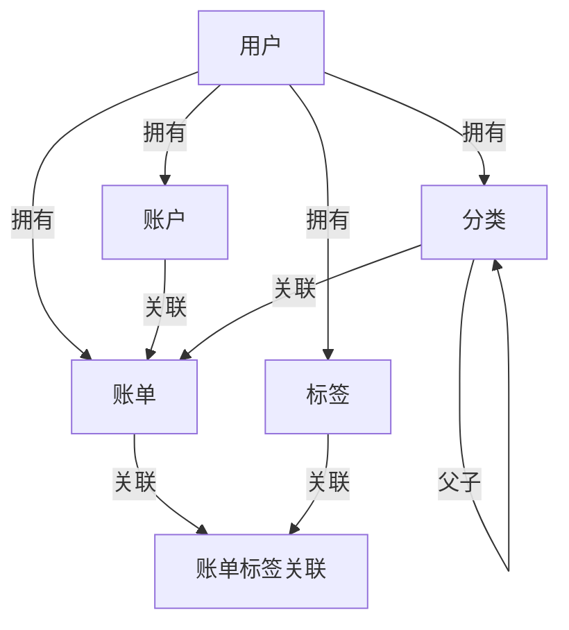
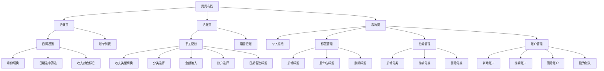

> 本文件只描述需求相关信息，逻辑说明，功能实现方式，不写具体的技术实现和UI要求
# 一、版本信息

| **文档版本** | **变更人** | **时间** | **主要变更内容** |
| -------- | ------- | ------ | ---------- |
| v0.1.0   | 谢天      |        | 创建文档       |

# 二、需求概述

## 需求背景 

用户有日常记账需求，需要开发一个微信记账小程序

## 需求目标

支持日常手工记账；支持语音记账

## 用户画像

## 方案说明

一期开发微信小程序，接入语音大模型；二期开发APP

## 用户故事

| **#** | **用户故事** | **验收标准** | **优先级** | **版本** |
| ----- | --------- | :------- | ------- | ------ |
| US-01 | 作为用户，我希望手动添加一笔收入/支出记录，以便追踪日常资金流向 | 可选择收支类型、金额、分类、时间、备注；保存后立即显示在账单列表 | P0 | v1.0 |
| US-02 | 作为用户，我希望通过语音描述来记账，以便在不方便打字时快速录入 | 识别语音后自动解析金额、分类、备注并填入表单；用户可修改后确认保存 | P0 | v1.0 |
| US-03 | 作为用户，我希望查看按日/月汇总的账单，以便了解整体收支情况 | 可按日、月维度切换；显示总收入、总支出、结余 | P1 | v1.0 |
| US-04 | 作为用户，我希望按分类查看支出占比，以便发现消费习惯 | 显示各分类金额及百分比，支持饼图或列表展示 | P1 | v1.0 |
| US-05 | 作为用户，我希望编辑或删除已有账单记录，以便纠正录入错误 | 可修改全部字段；删除需二次确认；软删除不影响历史统计 | P0 | v1.0 |
| US-06 | 作为用户，我希望自定义收支分类，以便记账更贴合个人习惯 | 可新增、编辑、删除自定义分类；分类名称不可重复 | P1 | v1.0 |
| US-07 | 作为用户，我希望设置多个账户（现金、银行卡、支付宝等），以便分账管理资产 | 可创建账户并在记账时选择；支持查看各账户余额 | P0 | v1.0 |
| US-08 | 作为用户，我希望通过微信登录，以便无需注册即可使用 | 微信授权后自动创建账号；个人数据与微信账号绑定 | P0 | v1.0 |

## 系统规划

| **阶段** | **目标** | **预计上线日期** | 实际上线日期 | 状态  |
| ------ | ------ | :--------- | :----- | :-- |
| 第1阶段   | 微信小程序上线：手工记账 + 语音记账 + 账单统计 | - | - | 规划中 |
| 第2阶段   | APP 上线（iOS + Android） | - | - | 规划中 |

# 三、整体说明

## 实体关系



## 数据结构

### 用户表 (users)

| 字段名 | 数据类型 | 必填 | 说明 |
| :-- | :--- | :- | :- |
| id | bigint | 是 | 主键，自增 |
| openid | varchar(64) | 是 | 微信 openid，唯一 |
| nickname | varchar(50) | 否 | 昵称 |
| avatar_url | varchar(255) | 否 | 头像 URL |
| phone | varchar(11) | 否 | 手机号，固定11位数字 |
| status | tinyint(1) | 是 | 状态：1正常 0禁用，默认1 |
| is_deleted | tinyint(1) | 是 | 软删除：0否 1是，默认0 |
| created_at | datetime | 是 | 创建时间 |
| updated_at | datetime | 是 | 更新时间 |

### 账户表 (accounts)

| 字段名 | 数据类型 | 必填 | 说明 |
| :-- | :--- | :- | :- |
| id | bigint | 是 | 主键，自增 |
| user_id | bigint | 是 | 关联用户 |
| name | varchar(50) | 是 | 账户名称，同用户下唯一 |
| type | tinyint | 是 | 类型：1现金 2银行卡 3支付宝 4微信 5其他 |
| balance | decimal(12,2) | 是 | 当前余额，默认0 |
| icon | varchar(50) | 否 | 图标标识 |
| sort | int | 是 | 排序，默认0 |
| is_default | tinyint(1) | 是 | 是否默认账户：0否 1是，默认0；同用户下唯一 |
| is_deleted | tinyint(1) | 是 | 软删除：0否 1是，默认0 |
| created_at | datetime | 是 | 创建时间 |
| updated_at | datetime | 是 | 更新时间 |

### 分类表 (categories)

| 字段名 | 数据类型 | 必填 | 说明 |
| :-- | :--- | :- | :- |
| id | bigint | 是 | 主键，自增 |
| user_id | bigint | 是 | 关联用户 |
| parent_id | bigint | 否 | 父分类 ID；NULL 为顶级分类，最多两级 |
| name | varchar(50) | 是 | 分类名称，同用户下同父级唯一 |
| type | tinyint(1) | 是 | 类型：1支出 2收入 |
| icon | varchar(50) | 否 | 图标标识 |
| sort | int | 是 | 排序，默认0 |
| last_used_at | datetime | 否 | 最近使用时间；记账保存时更新；NULL 表示从未使用；仅叶子分类有效 |
| is_deleted | tinyint(1) | 是 | 软删除：0否 1是，默认0 |
| created_at | datetime | 是 | 创建时间 |
| updated_at | datetime | 是 | 更新时间 |

> 系统内置分类以种子数据形式维护，新用户注册时自动复制一份到其名下；用户可自由编辑、删除。账单只可挂叶子节点分类（无子分类的节点）。

### 账单表 (bills)

| 字段名 | 数据类型 | 必填 | 说明 |
| :-- | :--- | :- | :- |
| id | bigint | 是 | 主键，自增 |
| user_id | bigint | 是 | 关联用户 |
| account_id | bigint | 是 | 关联账户 |
| category_id | bigint | 是 | 关联分类（叶子节点） |
| type | tinyint(1) | 是 | 类型：1支出 2收入 |
| amount | decimal(12,2) | 是 | 金额，必须 > 0 |
| remark | varchar(255) | 否 | 备注 |
| bill_date | date | 是 | 记账日期 |
| source | tinyint(1) | 是 | 来源：1手工录入 2语音识别 |
| voice_text | varchar(500) | 否 | 语音原始文本，语音记账时保存 |
| is_deleted | tinyint(1) | 是 | 软删除：0否 1是，默认0 |
| created_at | datetime | 是 | 创建时间 |
| updated_at | datetime | 是 | 更新时间 |

### 标签表 (tags)

| 字段名 | 数据类型 | 必填 | 说明 |
| :-- | :--- | :- | :- |
| id | bigint | 是 | 主键，自增 |
| user_id | bigint | 是 | 关联用户 |
| name | varchar(20) | 是 | 标签名，同用户下唯一 |
| is_deleted | tinyint(1) | 是 | 软删除：0否 1是，默认0 |
| created_at | datetime | 是 | 创建时间 |
| updated_at | datetime | 是 | 更新时间 |

### 账单标签关联表 (bill_tags)

| 字段名 | 数据类型 | 必填 | 说明 |
| :-- | :--- | :- | :- |
| id | bigint | 是 | 主键，自增 |
| bill_id | bigint | 是 | 关联账单 |
| tag_id | bigint | 是 | 关联标签 |
| created_at | datetime | 是 | 创建时间 |

> 删除标签时，bill_tags 对应记录同步删除；账单仅关联当前用户自己的标签。

## 功能结构



## 功能清单

| **一级模块** | **二级模块** | **功能** | **功能描述** | **优先级** | **状态** | 用户故事ID |
| -------- | -------- | ------ | -------- | ------- | :----- | ------ |
| 账单管理 | 手工记账 | 新增账单 | 选择收支类型、金额、分类、账户、日期、备注、标签后保存 | P0 | 待开发 | US-01 |
| 账单管理 | 手工记账 | 快速添加二级分类 | 在分类选择网格末位单元格点击"添加"，弹出添加二级分类弹窗，完成后新分类自动插入并选中 | P1 | 待开发 | US-06 |
| 账单管理 | 语音记账 | 语音识别记账 | 录音后调用大模型解析金额、分类、备注，填入表单供用户确认保存 | P0 | 待开发 | US-02 |
| 账单管理 | 账单列表 | 日历视图 | 日历展示每日收支，颜色区分收入/支出，支持月份切换，点击日期筛选账单 | P0 | 待开发 | US-03 |
| 账单管理 | 账单列表 | 账单列表 | 按 bill_date 倒序展示，按日分组；选中日期时只显示当日账单 | P0 | 待开发 | US-03 |
| 账单管理 | 账单详情 | 查看详情 | 点击账单条目查看完整信息 | P0 | 待开发 | US-01 |
| 账单管理 | 账单编辑 | 编辑账单 | 修改已有账单的所有字段 | P0 | 待开发 | US-05 |
| 账单管理 | 账单编辑 | 删除账单 | 软删除账单，需二次确认 | P0 | 待开发 | US-05 |
| 统计分析 | 分类统计 | 支出占比 | 按分类展示当月支出金额及百分比 | P1 | 待开发 | US-04 |
| 账户管理 | 账户列表 | 查看账户 | 展示所有账户及各账户余额 | P1 | 待开发 | US-07 |
| 账户管理 | 账户管理 | 新增账户 | 创建新账户，选择类型和名称，同用户下名称唯一 | P1 | 待开发 | US-07 |
| 账户管理 | 账户管理 | 编辑账户 | 修改账户名称、类型 | P1 | 待开发 | US-07 |
| 账户管理 | 账户管理 | 删除账户 | 软删除，有关联账单时不可删除 | P1 | 待开发 | US-07 |
| 账户管理 | 账户管理 | 设为默认 | 将指定账户设为默认账户，原默认账户自动取消 | P1 | 待开发 | US-07 |
| 分类管理 | 分类列表 | 查看分类 | 按收/支两个 tab 展示两级分类树 | P1 | 待开发 | US-06 |
| 分类管理 | 分类管理 | 新增分类 | 新增大类或子分类，同用户同层级名称不可重复 | P1 | 待开发 | US-06 |
| 分类管理 | 分类管理 | 编辑分类 | 修改分类名称和图标 | P1 | 待开发 | US-06 |
| 分类管理 | 分类管理 | 删除分类 | 软删除；有子分类或关联账单时不可删除 | P1 | 待开发 | US-06 |
| 个人中心 | 登录 | 微信登录 | 微信授权登录，自动创建账号并初始化种子数据 | P0 | 待开发 | US-08 |
| 个人中心 | 个人信息 | 查看资料 | 展示昵称、头像，不支持编辑 | P2 | 待开发 | US-08 |
| 个人中心 | 标签管理 | 查看标签 | 展示当前用户所有标签 | P2 | 待开发 | - |
| 个人中心 | 标签管理 | 新增标签 | 创建新标签，同用户下名称不可重复 | P2 | 待开发 | - |
| 个人中心 | 标签管理 | 重命名标签 | 修改标签名称，关联账单自动同步 | P2 | 待开发 | - |
| 个人中心 | 标签管理 | 删除标签 | 软删除标签，bill_tags 对应记录同步删除 | P2 | 待开发 | - |


# 四、功能需求

## 整体布局

```
┌──────────────────────────┐
│                          │
│         页面内容          │
│                          │
├──────────────────────────┤
│  [记录]    [  ⊕  ]  [我的] │
└──────────────────────────┘
```

> Tab 栏自定义开发；中间按钮为圆形，默认显示"+"，进入记账页后变为语音图标。

---

## 记录页

### 页面原型

```
┌──────────────────────────────┐
│       < 2025年05月 >          │
│  一    二    三    四    五    六    日  │
│                  1     2     3     4  │
│  5     6     7     8     9    10    11 │
│ 12    13   [14]   15    16    17    18 │
│ 19    20    21    22    23    24    25 │
│ 26    27    28    29    30    31       │
├──────────────────────────────┤
│ 05月14日   支出¥80   收入¥0    │
│ ──────────────────────────── │
│ [图标] 餐饮·午餐       -¥25   │
│ [图标] 交通·打车       -¥55   │
│                              │
│ 05月13日   支出¥0   收入¥5000  │
│ ──────────────────────────── │
│ [图标] 工资           +¥5000  │
└──────────────────────────────┘
```

### 页面说明

| **#** | **对象** | **说明** |
| ----- | ------ | ------- |
| 1 | 页面作用 | 以日历 + 账单列表形式展示账单记录，支持按日期筛选 |
| 2 | 日历区域 | 固定在页面顶部，显示当前月份；第一列为星期一，最后一列为星期日 |
| 3 | 账单列表 | 日历下方，可滚动；按 bill_date 倒序、日期分组展示 |
| 4 | 数据来源 | 查询当前用户所有未删除账单；默认不过滤日期 |

### 功能说明

| **#** | **对象** | **交互说明** | **逻辑说明** |
| ----- | ------ | -------- | -------- |
| 1 | 月份切换 | 点击日历顶部左右箭头切换月份 | 切换后日历渲染对应月份，账单列表不联动，仍显示全部 |
| 2 | 日期单元格 | 每格显示日期数字；当日有支出直接显示绿色金额数字，有收入直接显示红色金额数字，均有则同时显示；无数据则不显示 | 金额数字直接展示在日期单元格内，支出绿色、收入红色 |
| 3 | 日期选中 | 点击日期单元格高亮选中，账单列表切换为该日账单；再次点击取消选中，恢复显示全部账单 | 选中态下列表标题显示所选日期；取消选中后恢复默认排序 |
| 4 | 账单列表分组 | 按日期分组，每组头部显示日期及当日收支合计 | 合计 = 当日所有未删除账单求和，收支分开计算 |
| 5 | 账单条目 | 显示分类图标、分类名（大类·子类）、金额（支出绿色负数，收入红色正数）、备注 | 点击条目进入账单详情页 |
| 6 | 账单详情 | 展示账单所有字段：类型、金额、分类、账户、日期、备注、标签、来源 | 提供编辑和删除入口 |
| 7 | 编辑账单 | 进入编辑表单，所有字段可修改 | 保存后账户余额同步更新 |
| 8 | 删除账单 | 弹出二次确认弹窗 | 确认后软删除，账户余额同步回滚 |

---

## 记账页

### 页面原型

```
┌──────────────────────────────┐
│  [支出]  [收入]               │
│  餐饮 › 午餐                  │
│                    ¥ 25.00   │
├──────────────────────────────┤
│ 最近使用                      │
│ [午餐]  [打车]  [日用品]  [游戏] │
├──────────────────────────────┤
│ 餐饮                         │
│ [早餐]  [午餐]  [晚餐]         │
│ [零食饮料]  [餐厅聚餐]          │
│                              │
│ 交通                         │
│ [公交地铁]  [打车]  [加油]  [停车]│
│ …                            │
├──────────────────────────────┤
│   7      8      9     ← 删除  │
│   4      5      6     完  成  │
│   1      2      3            │
│   .      0     00            │
└──────────────────────────────┘
│   [记录]      [ 🎙 ]      [我的] │  ← 进入记账页后中间按钮变为语音图标
```

### 页面说明

| **#** | **对象** | **说明** |
| ----- | ------ | ------- |
| 1 | 页面作用 | 快速录入一笔收支账单，支持手工输入和语音识别两种方式 |
| 2 | 页面布局 | 顶部收支类型 + 已选分类 + 金额；中部分类选择区；底部自定义数字键盘 |
| 3 | 数据来源 | 分类列表查询当前用户未删除叶子分类；排序规则：`last_used_at` 不为 NULL 的优先，按 `last_used_at` DESC 排在前；其余按 `sort` ASC 排在后 |

### 功能说明

| **#** | **对象** | **交互说明** | **逻辑说明** |
| ----- | ------ | -------- | -------- |
| 1 | 收支切换 | 顶部切换支出/收入，分类列表随之切换 | 默认为支出 |
| 2 | 分类选择 | 中部平铺展示当前收支类型下所有子分类，按大类分组；顶部优先展示最近使用 | 点击子分类即选中，顶部显示"大类 › 子类"；已选中分类高亮 |
| 2a | 添加二级分类（分类选择入口） | 分类选择网格的最后一个单元格固定展示"添加"按钮（＋图标 + 文字） | 点击后弹出"添加二级分类"弹窗；完成后新分类插入对应大类末位并自动选中 |
| 3 | 金额输入 | 底部自定义数字键盘输入，支持小数点，最多保留 2 位小数 | 初始显示 ¥ 0.00；"←"删除末位；"00"追加两个零 |
| 4 | 完成保存 | 点击"完成"保存账单 | 分类和金额（>0）必填；账户默认取默认账户；日期默认今日；保存后返回记录页，中间按钮恢复"+" |
| 5 | 语音记账 | 点击中间语音图标按住录音，松开后识别 | 大模型解析结果自动填入金额、分类、备注字段；用户可修改后点击"完成"保存；source 记录为 2 |
| 6 | 更多信息 | 完成前可展开填写账户、日期、备注、标签 | 折叠态不影响保存，使用默认值 |

---

## 我的页

### 页面原型

```
┌──────────────────────────┐
│  [头像]  昵称             │
│          手机号（已绑定）  │
├──────────────────────────┤
│  标签管理              >  │
│  分类管理              >  │
│  账户管理              >  │
└──────────────────────────┘
```

### 页面说明

| **#** | **对象** | **说明** |
| ----- | ------ | ------- |
| 1 | 页面作用 | 展示个人信息，提供标签、分类、账户管理入口 |
| 2 | 数据来源 | 查询当前登录用户信息 |

### 功能说明

| **#** | **对象** | **交互说明** | **逻辑说明** |
| ----- | ------ | -------- | -------- |
| 1 | 个人信息 | 展示头像和昵称，只读，不支持编辑 | - |
| 2 | 标签管理 | 列表展示所有标签；支持新增、重命名、删除 | 删除时软删除标签，bill_tags 对应记录同步删除；同用户下标签名不可重复 |
| 3 | 分类管理 | 按支出/收入 tab 展示两级分类树；支持新增大类、新增子分类、编辑、删除 | 有子分类或关联账单的分类不可删除；同用户同层级名称不可重复 |
| 4 | 账户管理 | 列表展示所有账户及余额；支持新增、编辑、删除、设为默认 | 有关联账单的账户不可删除；设为默认时原默认账户自动取消 |

### 标签管理

# 五、非功能需求

## 数据埋点

## 性能要求

# 六、上线准备及检查

## 权限配置

## 数据迁移

## 种子数据

> 新用户注册时由程序执行，将 `{user_id}` 替换为实际用户 ID。

### 账户

```sql
SET @uid = {user_id};

INSERT INTO accounts (user_id, name, type, balance, sort, is_default, is_deleted, created_at, updated_at)
VALUES (@uid, '现金', 1, 0.00, 1, 1, 0, NOW(), NOW());
```

### 分类

```sql
SET @uid = {user_id};

-- 支出大类
INSERT INTO categories (user_id, parent_id, name, type, sort, is_deleted, created_at, updated_at)
VALUES (@uid, NULL, '餐饮', 1, 1, 0, NOW(), NOW());
SET @pid_餐饮 = LAST_INSERT_ID();

INSERT INTO categories (user_id, parent_id, name, type, sort, is_deleted, created_at, updated_at)
VALUES (@uid, NULL, '交通', 1, 2, 0, NOW(), NOW());
SET @pid_交通 = LAST_INSERT_ID();

INSERT INTO categories (user_id, parent_id, name, type, sort, is_deleted, created_at, updated_at)
VALUES (@uid, NULL, '购物', 1, 3, 0, NOW(), NOW());
SET @pid_购物 = LAST_INSERT_ID();

INSERT INTO categories (user_id, parent_id, name, type, sort, is_deleted, created_at, updated_at)
VALUES (@uid, NULL, '娱乐', 1, 4, 0, NOW(), NOW());
SET @pid_娱乐 = LAST_INSERT_ID();

INSERT INTO categories (user_id, parent_id, name, type, sort, is_deleted, created_at, updated_at)
VALUES (@uid, NULL, '居家', 1, 5, 0, NOW(), NOW());
SET @pid_居家 = LAST_INSERT_ID();

INSERT INTO categories (user_id, parent_id, name, type, sort, is_deleted, created_at, updated_at)
VALUES (@uid, NULL, '医疗', 1, 6, 0, NOW(), NOW());
SET @pid_医疗 = LAST_INSERT_ID();

INSERT INTO categories (user_id, parent_id, name, type, sort, is_deleted, created_at, updated_at)
VALUES (@uid, NULL, '教育', 1, 7, 0, NOW(), NOW());
SET @pid_教育 = LAST_INSERT_ID();

INSERT INTO categories (user_id, parent_id, name, type, sort, is_deleted, created_at, updated_at)
VALUES (@uid, NULL, '人情', 1, 8, 0, NOW(), NOW());
SET @pid_人情 = LAST_INSERT_ID();

-- 餐饮子分类
INSERT INTO categories (user_id, parent_id, name, type, sort, is_deleted, created_at, updated_at) VALUES
(@uid, @pid_餐饮, '早餐',     1, 1, 0, NOW(), NOW()),
(@uid, @pid_餐饮, '午餐',     1, 2, 0, NOW(), NOW()),
(@uid, @pid_餐饮, '晚餐',     1, 3, 0, NOW(), NOW()),
(@uid, @pid_餐饮, '零食饮料', 1, 4, 0, NOW(), NOW()),
(@uid, @pid_餐饮, '餐厅聚餐', 1, 5, 0, NOW(), NOW());

-- 交通子分类
INSERT INTO categories (user_id, parent_id, name, type, sort, is_deleted, created_at, updated_at) VALUES
(@uid, @pid_交通, '公交地铁', 1, 1, 0, NOW(), NOW()),
(@uid, @pid_交通, '打车',     1, 2, 0, NOW(), NOW()),
(@uid, @pid_交通, '加油',     1, 3, 0, NOW(), NOW()),
(@uid, @pid_交通, '停车',     1, 4, 0, NOW(), NOW());

-- 购物子分类
INSERT INTO categories (user_id, parent_id, name, type, sort, is_deleted, created_at, updated_at) VALUES
(@uid, @pid_购物, '日用品',   1, 1, 0, NOW(), NOW()),
(@uid, @pid_购物, '服装',     1, 2, 0, NOW(), NOW()),
(@uid, @pid_购物, '数码电器', 1, 3, 0, NOW(), NOW()),
(@uid, @pid_购物, '家居用品', 1, 4, 0, NOW(), NOW());

-- 娱乐子分类
INSERT INTO categories (user_id, parent_id, name, type, sort, is_deleted, created_at, updated_at) VALUES
(@uid, @pid_娱乐, '电影演出', 1, 1, 0, NOW(), NOW()),
(@uid, @pid_娱乐, '游戏',     1, 2, 0, NOW(), NOW()),
(@uid, @pid_娱乐, '运动健身', 1, 3, 0, NOW(), NOW()),
(@uid, @pid_娱乐, '旅游',     1, 4, 0, NOW(), NOW());

-- 居家子分类
INSERT INTO categories (user_id, parent_id, name, type, sort, is_deleted, created_at, updated_at) VALUES
(@uid, @pid_居家, '房租',     1, 1, 0, NOW(), NOW()),
(@uid, @pid_居家, '水电燃气', 1, 2, 0, NOW(), NOW()),
(@uid, @pid_居家, '物业维修', 1, 3, 0, NOW(), NOW());

-- 医疗子分类
INSERT INTO categories (user_id, parent_id, name, type, sort, is_deleted, created_at, updated_at) VALUES
(@uid, @pid_医疗, '看病就医', 1, 1, 0, NOW(), NOW()),
(@uid, @pid_医疗, '药品',     1, 2, 0, NOW(), NOW()),
(@uid, @pid_医疗, '体检',     1, 3, 0, NOW(), NOW());

-- 教育子分类
INSERT INTO categories (user_id, parent_id, name, type, sort, is_deleted, created_at, updated_at) VALUES
(@uid, @pid_教育, '学费',     1, 1, 0, NOW(), NOW()),
(@uid, @pid_教育, '书籍文具', 1, 2, 0, NOW(), NOW()),
(@uid, @pid_教育, '培训课程', 1, 3, 0, NOW(), NOW());

-- 人情子分类
INSERT INTO categories (user_id, parent_id, name, type, sort, is_deleted, created_at, updated_at) VALUES
(@uid, @pid_人情, '红包礼金', 1, 1, 0, NOW(), NOW()),
(@uid, @pid_人情, '聚餐请客', 1, 2, 0, NOW(), NOW());

-- 收入大类（叶子节点，无子分类）
INSERT INTO categories (user_id, parent_id, name, type, sort, is_deleted, created_at, updated_at) VALUES
(@uid, NULL, '工资', 2, 1, 0, NOW(), NOW()),
(@uid, NULL, '兼职', 2, 2, 0, NOW(), NOW()),
(@uid, NULL, '理财', 2, 3, 0, NOW(), NOW()),
(@uid, NULL, '红包', 2, 4, 0, NOW(), NOW());
```
